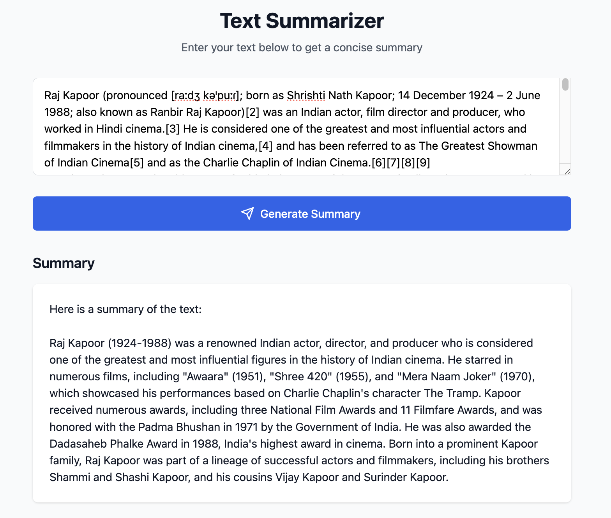

# Text Summarizer

A web application that summarizes text using AI. Built with React, Flask, and LangChain.

## Project Structure

```
├── backend/           # Flask backend
│   ├── app.py
│   ├── routes.py
│   └── summarizer.py
└── frontend/         # React frontend
    ├── src/
    ├── public/
    └── package.json
```

## Setup Instructions

### Frontend

1. Install dependencies:
   ```bash
   npm install
   ```

2. Create `.env` file from template:
   ```bash
   cp .env.example .env
   ```

3. Start development server:
   ```bash
   npm run dev
   ```

### Backend

1. Create virtual environment:
   ```bash
   python -m venv venv
   source venv/bin/activate  # On Windows: venv\Scripts\activate
   ```

2. Install dependencies:
   ```bash
   pip install -r backend/requirements.txt
   ```

3. Start Flask server:
   ```bash
   cd backend
   python app.py
   ```
